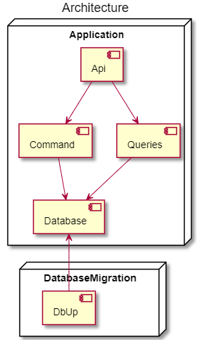
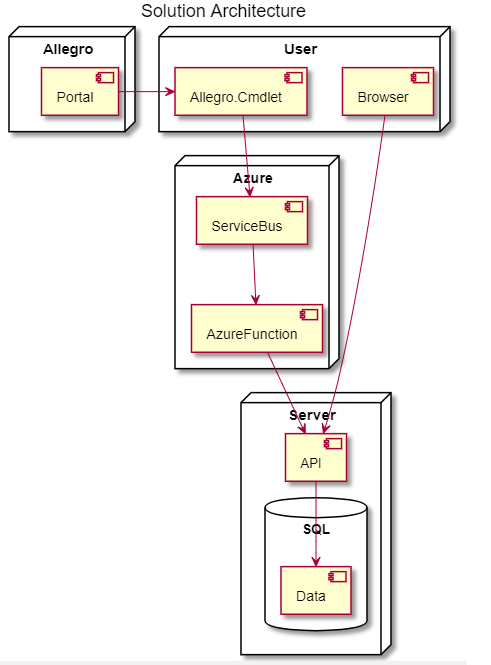
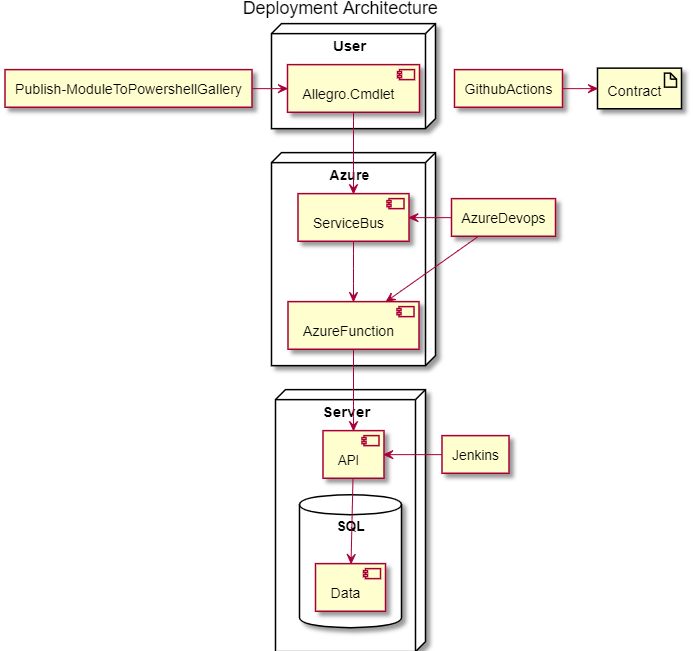

<!--Category:Powershell--> 
 

    <a href="http://productivitytools.tech/XXX/"><a> 
    

    

# Purchase Api

<!--more-->

<!--og-image-->

## Solution Architecture

## Deployment architecture

